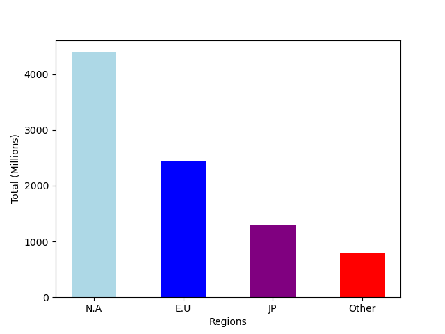

# Business Data Analysis

**1.Business Scenario & Problem :**

I work for a video game company. Recently we have seen a decline in sales. I've been 
tasked with finding ways to maximize our sales through targeted marketing. I have a
dataset with a breakdown of sales by region and genre.  

**Potential Questions**

What countries/regions should we focus on? What genre of games should we focus on?

**2. Data Life Cycle** 
 

**3. Excel Analysis**

For my excel analysis I created a pivot table that displayed the different regions as columns
and genres as rows. From this we can see how much each genre sold in each region.
Using the SUM function I calculated the total sales per genre across all regions. Using this table I created a bar chart
to display the total sales across all regions. I used the INDEX & MATCH functions to create a new column to display
the most profitable genre in each region.

<b>Pivot table:</b>

<b>Bar Graph using Excel:</b>

**4. Python Analysis**

Using pandas built in method DataFrame.Head() I printed the first 5 rows on to the console. I got the data type for each column using pandas built in method dtypes.
Using pandas method DataFrame.sum() I got the sum of a specific column. In my case I wanted the sum of each regions' sales. 
With this new total I created a new dataframe that contained the 5 regions
as columns and the total sales as a row. Lastly using matplotlib I created a bar graph that shows the total sales
by region. All of this this is shown below. 

<b>Bar Graph using matplotlib:</b>

<b>5. Data Types :</b> 
Text Most of my data types are numeric and quantitative. Since the sales are in decimals, it would be considered
as continous data. My data was pulled from [Kaggle](https://www.kaggle.com/datasets/anandshaw2001/video-game-sales) text

**6. Conclusion** 
Moving forward I would like to explore the corelation between the genres with the most sales and crimes in the region. 
  For this I would need an additional data set and a way to directly compare the two sets. 
<b>Three Things I learned</b>

  * How git works remotely and the importance of making sure I am only making changes in one place
   * How to use matplotlib to create graphics
   * How to use pandas to manipulate data from a csv file

